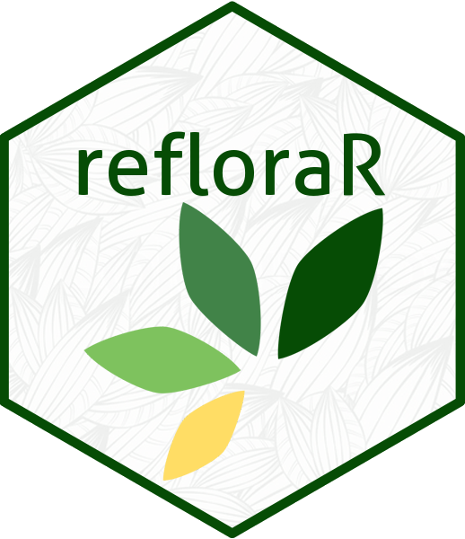

<!-- README.md is generated from README.Rmd. Please edit that file -->

```{r, include = FALSE}
knitr::opts_chunk$set(
  collapse = TRUE,
  comment = "#>",
  fig.path = "man/figures/README-",
  out.width = "100%"
)
```

# refloraR 

<!-- badges: start -->
[](https://app.codecov.io/gh/DBOSlab/refloraR)
[](https://github.com/DBOSlab/refloraR/actions/workflows/test-coverage.yaml)
[](https://github.com/DBOSlab/refloraR/actions/workflows/R-CMD-check.yaml)
[](LICENSE)
<!-- badges: end -->


`refloraR` is an R package for accessing and analyzing plant specimen data from the [Reflora Virtual Herbarium](https://reflora.jbrj.gov.br/reflora/herbarioVirtual/), hosted by the [Rio de Janeiro Botanical Garden](https://www.gov.br/jbrj/pt-br). It provides tools for summarizing Reflora collections, downloading and parsing specimen records in Darwin Core Archive (DwC-A) format, retrieving and filtering occurrence records, and identifying indeterminate specimens, all via the [Reflora IPT](https://ipt.jbrj.gov.br/reflora/).


## Installation

You can install the development version of `refloraR` from [GitHub](https://github.com/DBOSlab/refloraR) with:

``` r
if (!requireNamespace("BiocManager", quietly = TRUE)) 
install.packages("BiocManager") 

# Install the development version of jabotR from GitHub, 
# together with its required dependencies 
BiocManager::install("DBOSlab/jabotR", dependencies = TRUE)
```

```r
library(refloraR)
```
\
\

## Usage

A general description of the main functions available in `refloraR` is provided below. These functions support a workflow from summarizing and downloading original Reflora collections to parsing specimen records, filtering occurrence data, and retrieving indeterminate specimens.\
\

#### _1. `reflora_summary`: Summarizing Reflora collections_

The following code can be used to extract a summary of all Reflora-associated collections, including herbarium acronym, curator's email contact, number of records and a direct link to the original Reflora Integrated Publishing Toolkit ([IPT](https://ipt.jbrj.gov.br/reflora)).\
```r
library(refloraR)

summary_df <- reflora_summary(verbose = TRUE,
                              save = TRUE,
                              records = "gbif",
                              dir = "reflora_summary")
```
\
By specifying a vector of herbarium acronyms, the user can extract a summary for just the specific herbarium collection.\

```r
summary_some_df <- reflora_summary(herbarium = c("ALCB", "RB", "HUEFS", "US", "K"),
                                   verbose = TRUE,
                                   save = TRUE,
                                   records = "gbif",
                                   dir = "reflora_summary")
```
\
The `records` argument controls whether GBIF is queried for indexed occurrence counts. Use `records = "gbif"` (the default) to populate the `Records` column, or `records = "none"` to skip those requests and get a faster, metadata-only summary (`Records` is returned as `NA`).\

```r
summary_fast_df <- reflora_summary(records = "none",
                                   save = FALSE)
```
\
\

#### _2. `reflora_download`: Downloading Reflora specimen records_

The following code can be used to download original specimen records in DwC-A format and associated metada for all Reflora collections.\

```r
library(refloraR)

reflora_download(verbose = TRUE,
                 dir = "reflora_download")
```
\
By specifying a vector of herbarium acronyms, the user can download specimens records for just the specific herbarium collection.\

```r
reflora_download(herbarium = c("ALCB", "HUEFS", "RB", "US", "K"),
                 verbose = TRUE,
                 dir = "reflora_download")
```
\
The downloaded DwC-A folders can subsequently be parsed with `reflora_parse()` or reused by other `refloraR` functions.\
\

#### _3. `reflora_parse`: Parsing downloaded DwC-A files_

`reflora_parse()` reads Reflora Darwin Core Archive folders and converts their occurrence records and associated metadata into R objects. It is useful when DwC-A files have already been downloaded using `reflora_download()` and the user wants to inspect or manipulate the original data directly.\

The following code parses all DwC-A folders located in the `"reflora_download"` directory.\

```r
dwca <- reflora_parse(path = "reflora_download",
                      verbose = TRUE)
```
\
Specific herbarium collections can also be selected.\

```r
dwca_some <- reflora_parse(path = "reflora_download",
                           herbarium = c("ALCB", "RB"),
                           verbose = TRUE)
```
\
The function returns a named list containing parsed DwC-A data and associated metadata for each collection.\
\

#### _4. `reflora_records`: Retrieving and filtering specimen records_

`reflora_records()` retrieves occurrence records from Reflora and allows users to filter specimens by herbarium, taxon, Brazilian state and collection year. The function can automatically download and parse the required DwC-A files or reuse files that have already been downloaded.\

For example, Fabaceae records from selected Reflora collections can be retrieved with:\

```r
fabaceae_records <- reflora_records(herbarium = c("ALCB", "HUEFS", "K", "RB"),
                                    taxon = "Fabaceae",
                                    verbose = TRUE,
                                    save = FALSE)
```
\
Taxonomic, geographic, and temporal filters can be combined.\

```r
filtered_records <- reflora_records(herbarium = "RB",
                                    taxon = "Fabaceae",
                                    state = c("Bahia", "Minas Gerais"),
                                    recordYear = c("2000", "2024"),
                                    verbose = TRUE,
                                    save = FALSE)
```
\
Previously downloaded DwC-A files can be reused by defining `path` and setting `updates = FALSE`.\

```r
filtered_records <- reflora_records(herbarium = "RB",
                                    taxon = "Fabaceae",
                                    path = "reflora_download",
                                    updates = FALSE,
                                    verbose = TRUE,
                                    save = FALSE)
```
\
By default, indeterminate specimens are retained. Setting `indets = FALSE` removes records that are not identified to species level.\

```r
species_records <- reflora_records(herbarium = "RB",
                                   taxon = "Fabaceae",
                                   indets = FALSE,
                                   verbose = TRUE,
                                   save = FALSE)
```
\
When `save = TRUE`, the retrieved records are saved as a CSV file and a `log.txt` file containing summary information is generated in the output directory.\
\

#### _5. `reflora_indets`: Retrieving indeterminate specimens_

`reflora_indets()` retrieves Reflora occurrence records for specimens that are not identified to species level. The function can be used to identify specimens determined only to higher taxonomic ranks, particularly family or genus, which can be useful for collection management and taxonomic curation.\

For example, family-level indeterminate Fabaceae records can be retrieved with:\

```r
family_indets <- reflora_indets(level = "FAMILY",
                                herbarium = "RB",
                                taxon = "Fabaceae",
                                verbose = TRUE,
                                save = FALSE)
```
\
Genus-level indeterminate records can be retrieved with:\

```r
genus_indets <- reflora_indets(level = "GENUS",
                               herbarium = "RB",
                               taxon = "Fabaceae",
                               verbose = TRUE,
                               save = FALSE)
```
\
Geographic and temporal filters can also be applied.\

```r
filtered_indets <- reflora_indets(level = "FAMILY",
                                  herbarium = "RB",
                                  taxon = "Fabaceae",
                                  state = c("Bahia", "Minas Gerais"),
                                  recordYear = c("2000", "2024"),
                                  verbose = TRUE,
                                  save = FALSE)
```
\
When `level = NULL`, all supported higher-rank indeterminate records are retained. Previously downloaded Reflora DwC-A files can also be reused.\

```r
family_indets <- reflora_indets(level = "FAMILY",
                                herbarium = "RB",
                                taxon = "Fabaceae",
                                path = "reflora_download",
                                updates = FALSE,
                                verbose = TRUE,
                                save = FALSE)
```
\
\

## Documentation
Full function documentation and articles are available at the `refloraR` [website](https://dboslab.github.io/refloraR-website/).\
\

## Citation
Calderón del Cid, C.; Versiane, A.F.A.; Leitman, P.; Filardi, F.R.; Forzza, R.C. & Cardoso, D. 2026. _refloraR_: An R package for efficiently retrieving and analyzing plant specimen data from the Herbário Virtual Reflora. Applications in Plant Sciences. https://github.com/DBOSlab/refloraR
